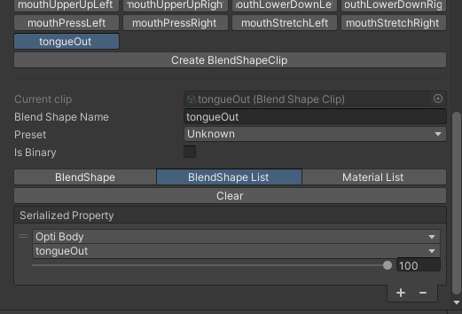

# Config IFacialMocap Blend Shapes

This utility is meant to help people set up the 52 blend shapes that are used by IFacialMocap compatible software to provide face-tracking for their 3D model.  
Due to this being a super monotonous task that gets infuriatingly boring after a while, I decided to make a little tool that sets it up for you, based on a single tool windows that defaults to what 99% of people have on their model already.

## How-to (4 super "complex" steps)

1. Open the tool `Tools` / `LauraRozier` / `Configure IFacialMocap Blend Shapes`  

2. Configure the tool
   1. Drag your VRM avatar descriptor into the tool window's `VRM Blend Shape Proxy` field
   2. Select the mesh containing your facial tracking blend shapes in the `Face Mesh` field  

3. Disable any blend shapes you don't want and set the names/values to the correct ones to match your avatar  

4. Click the big `Apply` button at the bottom, wait for Unity to do it's thing, happy claps  
  

